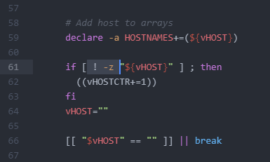

# binsync v1.0.5

#### Description:
Synchronize bin directory across multiple systems with rsync. Featuring a new installer. Linux only.

Usage example: You have 5 raspberry pi's all running arm64 raspbian and want to save time compiling once for all machines 
Usage example: You have 3 computer's all running amd64 debian and want to save time compiling once for all machines

### Disclaimer:
**I am not liable in any way for damages to your computer due to bugs, being hacked, exploited, or any other malfunction of the scripts. Having a directory with binaries automatically synchronized to every machine is inherently dangerous and can be exploited for malicious purposes. Please be advised of the risks and do not execute binaries that you did not place into the directory yourself. This source code is open, it is your responsibility to audit the code.**

#### Notes:
- It is important the instructions are completed in order!
- Read the notes about [cronjobs](#cronjobs) before installing
- You can only have one host machine under one root/user account
- You can have as many client machines as you like, under any root/user account
- Do not delete the bin directory unless you know what you're doing
- Do not delete the git repository directory, it installs in it's place

#### Gather client SSH keys:
1. Login as non-root user
2. `su` and enter root password if setting up root
3. Generate the key `ssh-keygen` (leave all options including password empty and press enter)
4. chmod 700 /root/.ssh/id_rsa
4. Print the key `cat ${HOME}/.ssh/id_rsa.pub`
5. Copy the line printed out into a notepad (yes it is one giant line)

#### Install keys on host machine:
1. Login as non-root user
2. `su` and enter root password if setting up root
3. `nano ${HOME}/.ssh/authorized_keys`
4. Copy the lines from notepad and paste into the file
5. Save & Exit

#### On the host machine:
1. Login as non-root user
2. `su` and enter root password if setting up root as the host
3. Change to directory you wish to install repository
4. Clone repo `git clone https://gogs.easyx.cc/EasyX-Community/binsync.git`
5. Change to repository directory `cd binsync`
6. Execute installer `./install_binsync.sh`
7. `source ~/.bashrc`
8. Note: Do not run push/pull manually or set up cronjob on the host machine! The clients do the push/pull!

#### On the client(s) machines:
1. Login as non-root user
2. `su` and enter root password if setting up root as the client
3. Change to directory you wish to install repository
4. Clone repo `git clone https://gogs.easyx.cc/EasyX-Community/binsync.git`
5. Change to repository directory `cd binsync`
6. Execute installer `./install_binsync.sh`
7. `source ~/.bashrc`
8. Run manually `binsync-push ; binsync-pull ;`

#### Updating (manual):
1. Run update script `binsync-update`

#### Cronjobs:
The installer will ask if you want it to install cronjob for you. It will also ask if you want it to install a weekly update cronjob for you.

It is advised you select **'yes'** and then if you want to change it you can use `crontab -e` later.

If you are unsure about crontab times, this calculator will come in handy [https://crontab.guru/](https://crontab.guru/)

#### Coming features:
- Can't think of any at the moment, but please create GitHub or Gogs issue ticket if you have any suggestions

#### Why origin/master ? Are you not inclusive?
Yes I am inclusive of persons inside my non-organization - but I am exclusive of persons outside my non-organization. I can not care for everyone in the world, no person can. You cannot re-write the dictionary. You'd be overloaded in both cases. Fairly logical. Aside from that there are 2 main reasons why I refuse to change away from origin/master:
- I use [Gogs](https://gogs.io/) primarily and other repository hosts, many of which use origin/master
- Look at the not z in the image below. Are you going to petition linux devs to replace unary logical operators too? Or how about reorganize the comparison operators?

Even if every repository host I utilize changes to something other than origin/master, I am still using it. I am used to it, it is not confusing, and it has nothing to do with: race, gender, identity, religion, disability, belief or any of the countless phobias. Programming code that is compiled down to non-readable code is no place for SJW-BS.

#### Donations:
**XMR:** 84wwa7EKo8uasZAHijHKtBTuBaMPuNjCJgnfGJrsLFo4aZcfrzGvUX33sSeFNdno8fPiTDGnz4h1bCvsdFQYWRuR2619FzS  
**ETH(ERC-20):** 0xc89eEa9b5C0cfa7f583dc1A6405a7d5730ADB603  
**BNB(BSC)** 0xc89eEa9b5C0cfa7f583dc1A6405a7d5730ADB603  
**RTM:** RDg5KstHYvxip77EiGhPKYNL3TZQr6456T  
**AVN:** R9zSPpKjo6tCutMT5FyyGNr2vRaAssEtrm  
**PHL:** F7XaUosKYEXPP62o31DdpDoADo3VcxoFP4  
**PEXA:** XBghzGLdeUzspUcJpeggPFLs3mAyTRHpPH  
